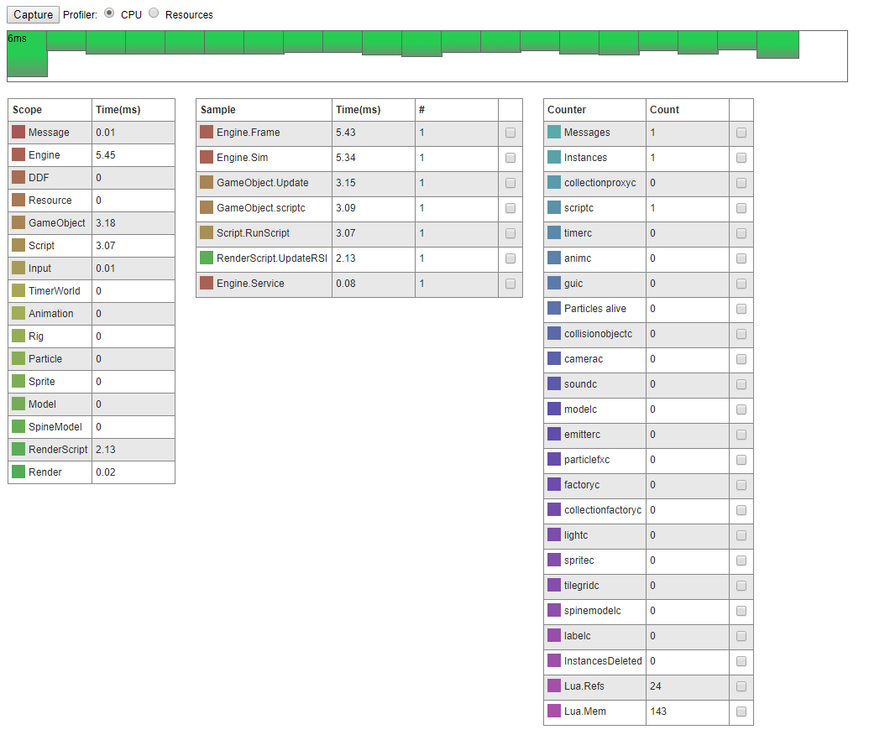
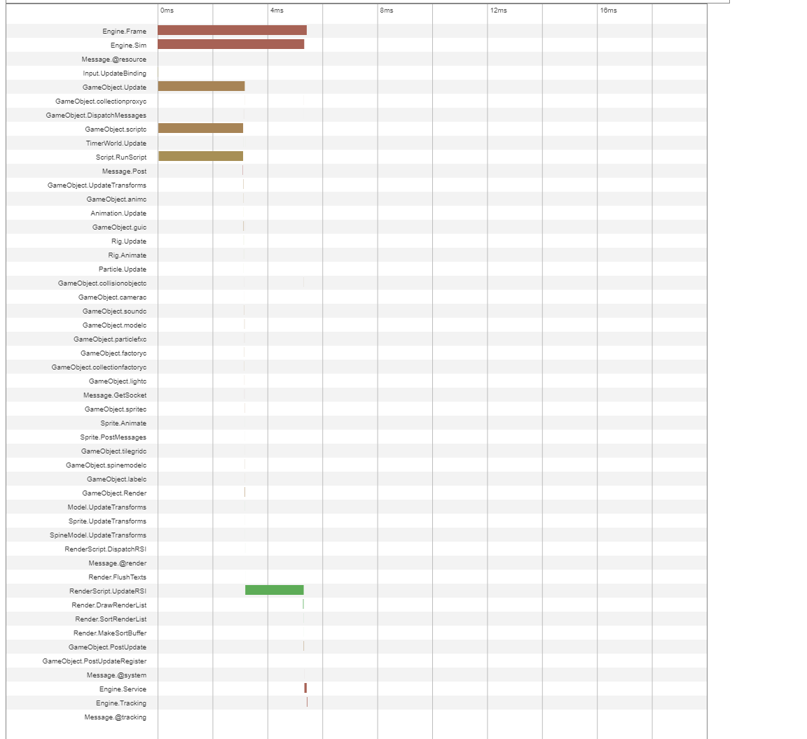

# Debugging Projects

### Debugging Tools

todo

### Web Profiler

So long as you are running a debug build / using an appmanifest which does not strip profiling, you you use the web profiler to inspect your running project. This is done simply by running the project and going to [http://localhost:8001/](http://localhost:8001/) in your browser. \(**todo** test with other non-localhost targets\)

You will see a page where you can capture frame data from the engine. You can also inspect the sizes of all resources currently being used in your project. 

Clicking the **Capture** button to get data from a fresh frame.

By using the web profiler, you can get a clue as to what is taking the most processing during each frame. If your game is running slow this is where you can go to see why. The example images below are for an empty project.

**todo** explain all of the options in the list.

