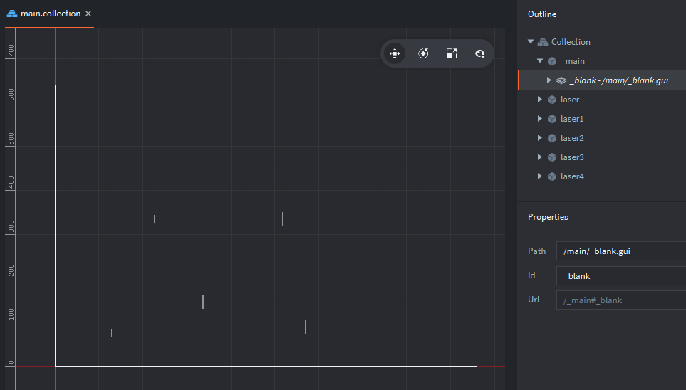

# GUIs for Window Size

Currently the live version of the editor does not show you the size of your game window set in your game.project file.

You can create a blank .gui file, add it to your collection, and then you'll be able to see the size of your game's window. This can help you with placement for some kinds of setups.

