# Editor Tour

## Splash

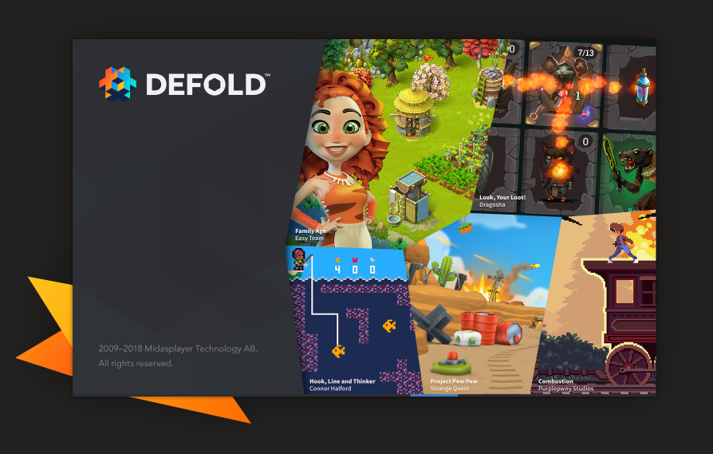

When you first launch Defold you will see a splash screen as the editor loads. Images of games made with Defold are periodically showcased here. Maybe one day your game will be!

## Launcher

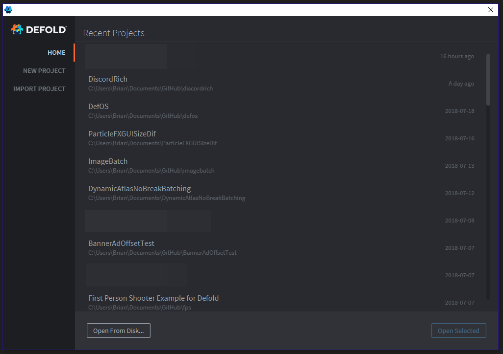

After the splash, you will see the launcher. Here you can open one of your recent projects, open any project from your computer, create a new project based on a template, and import from your Defold dashboard in the cloud.

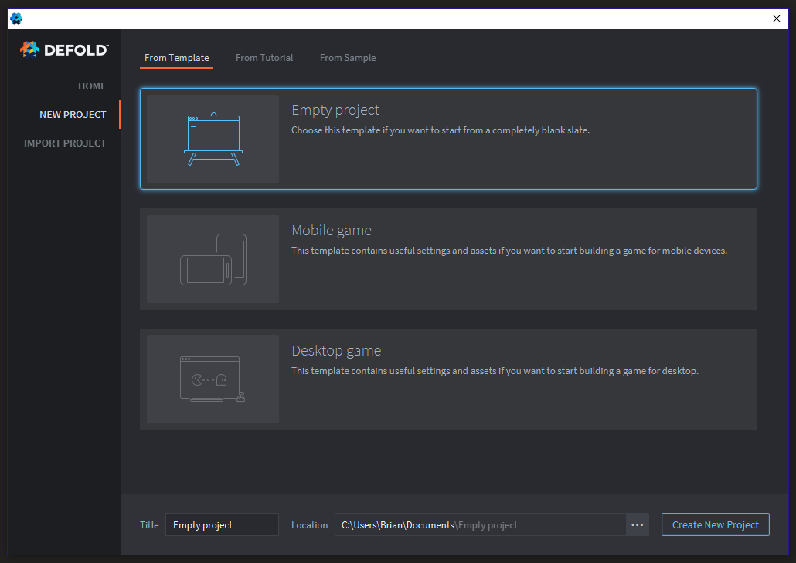

When creating a new project from the launcher, you can pick from various templates or starter projects either based on official tutorials or samples.

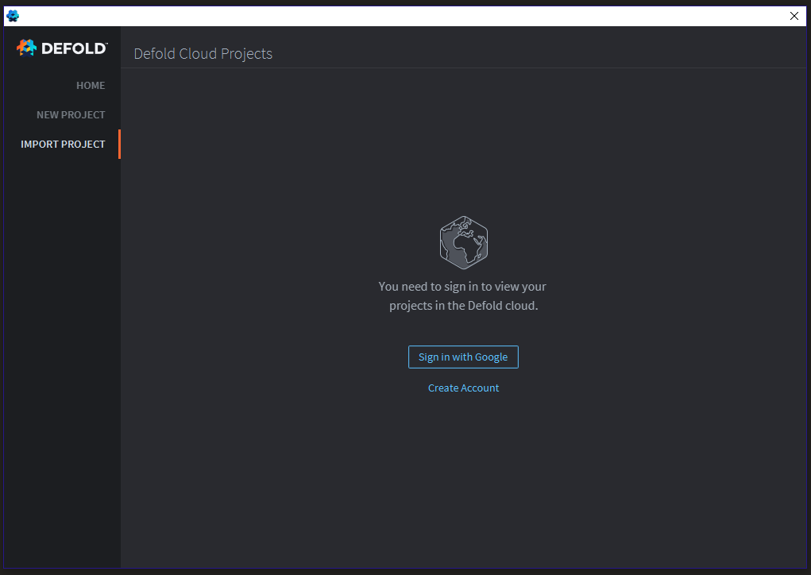

To import projects from the Defold cloud you must have created an account on Defold.com and created a project on your dashboard there. Using the Defold cloud is not required to make games with Defold. You can easily use your own Git hosting for your projects.

## Main Editor

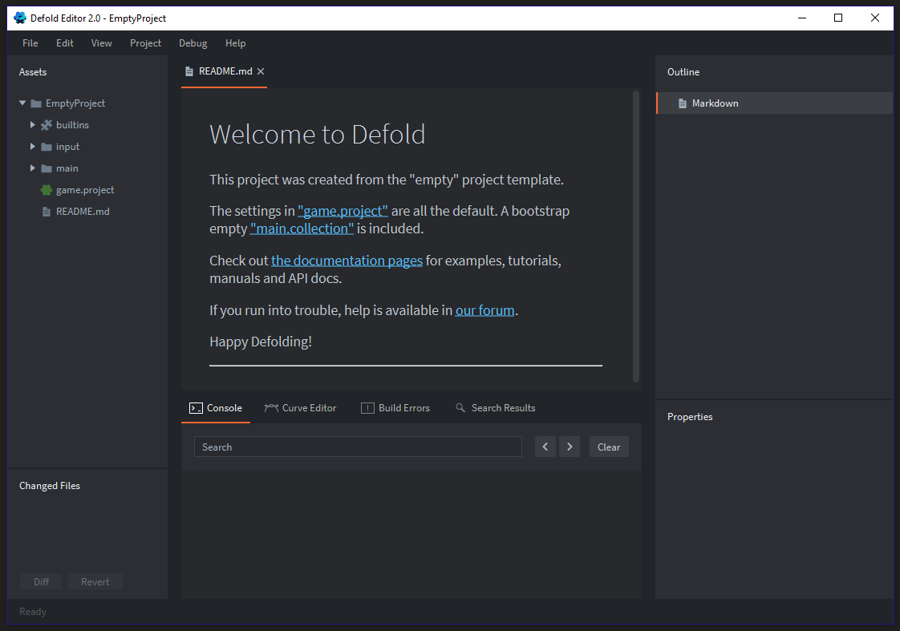

Once you've created from a template or loaded a project the main editor will open. 

### Assets

On the left is the **Assets** panel. These are the files that are inside of your project folder. The **builtins** folder is a special **read only** library that is included in all Defold projects with some essential defaults an empty project needs such as default shader materials. You can import other libraries too, but you cannot omit the **builtins**. Read only means you can't edit these files, you must make copies of them if you wish to use them as a base to make a custom version.

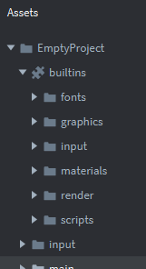

### Changed Files

On the bottom left is the **Changed Files**. This will show you any file modifications since your last git commit. If you use the editor's own git features or your own git setup the changed files will show here as long as you have a git repository setup. You can tell there is no git repository setup when no changed files history shows up, but also by the fact there is no .git folder in your project's home directory.

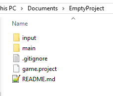

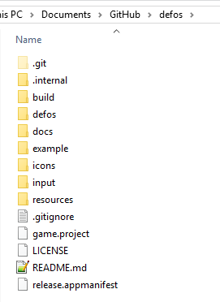

**.git** is used for git version control, **.internal** is used by the editor, and the **build** folder is for temporary files while building or bundling. You may occasionally need to delete your .internal or build folders if instructed. These folders should not be saved to your git version control, and you should be careful to not include them in any zips of your project as they are not needed and only add extra space.

### Outline

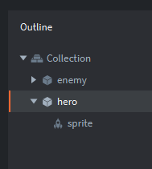

The outline panel shows a contextual tree of resources depending on what you have open in the editor. If you have a collection open then you'll likely see a list of **Game Objects \(GO\)** with their associated **Components**.

### Properties

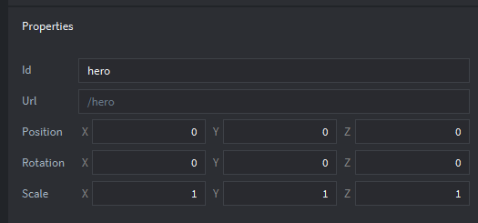

The properties panel shows contextual information based on what is selected in the **Outline**. Sometimes this information can be edited other times it's read only and only there to be useful information for you.

### Console

The console shows information when you build your project from **Project-&gt;Build**. When you **print\(\)** or **pprint\(\)** this will show up in the console. You can load a copy of the Defold engine onto a mobile device such as an Android phone, select it as a target with **Project-&gt;Target**, then when you build the information from the Android phone's copy of the engine running will be shown in your local console.

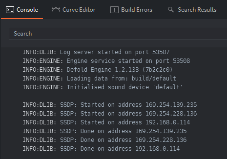

### Curve Editor

### Build Errors

### Search Results

### Scene Editor / Viewport

