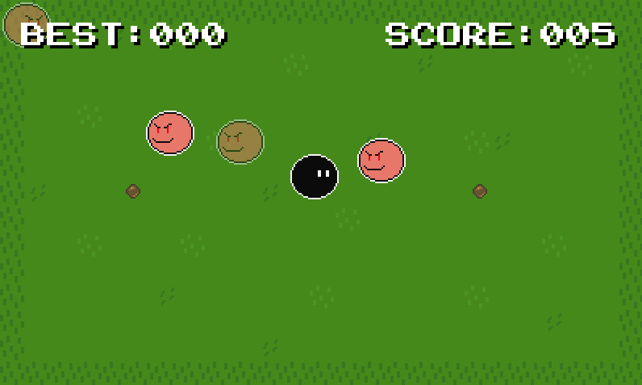

# Avoider - Action

TODO: make step by step tutorial.

The features of this game are:

* 2D action game.
* Player attempts to survive as long as possible. Best high score listed.
* Player controls a yellow smile face character with wasd or arrow keys. Player character can loop around the game board, but enemies cannot.
* Enemies spawn in from the middle and are ghosts for a few seconds before they can harm the player.

Demo: [https://www.bookofdefold.com/dive-into-defold/avoider/](https://www.bookofdefold.com/dive-into-defold/avoider/)



