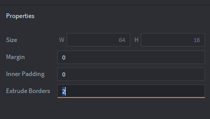
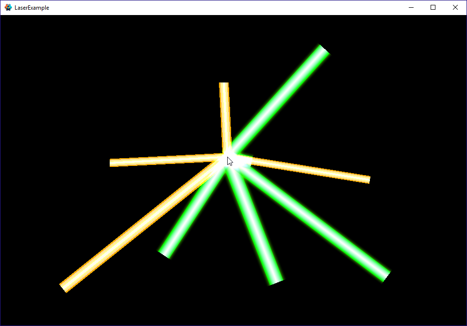

# Lasers

You can draw lasers / lines easily in Defold. You will need to place the laser/line segments in an atlas with edges extruded at 2.



Your segments need to have a width of 1. Then place their sprites on a .go so that their left side is at x of 0. This may require you to place them at x of 0.5 like in this example.

The important functions used in this example are dist2d to get the distances between two 2d points - this is used to determine how far to stretch the laser which is done through setting the x scale of the sprite's go, angle\_of\_vector\_between\_two\_points which returns the radian angle between two 2d points, and vmath.quat\_rotation\_z which returns a quaternion of the rotation around the z access based on the previously generated radian value. 





```lua
local function dist2d(x1, y1, x2, y2)
	return ((x2-x1)^2+(y2-y1)^2)^0.5
end

local function angle_of_vector_between_two_points(x1,y1, x2,y2) 
	return math.atan2(y2-y1, x2-x1) 
end

function init(self)
	msg.post(".", "acquire_input_focus")
	self.position = go.get_position()
	self.target_position = go.get_position()
	self.scale = go.get_scale()
	go.animate(".", "scale.y", go.PLAYBACK_LOOP_PINGPONG, 1.5, go.EASING_INOUTSINE, 1.2 + math.random(30) * 0.01)
end

function update(self, dt)
	local distance = dist2d(self.position.x, self.position.y, self.target_position.x, self.target_position.y)
	self.scale.x = distance
	go.set_scale(self.scale)
	local direction = angle_of_vector_between_two_points(self.position.x, self.position.y, self.target_position.x, self.target_position.y)
	local rotation = vmath.quat_rotation_z(direction)
	go.set_rotation(rotation)
end

function on_input(self, action_id, action)
	if action.x ~= nil then
		self.target_position.x = action.x
		self.target_position.y = action.y
	end
end


```






